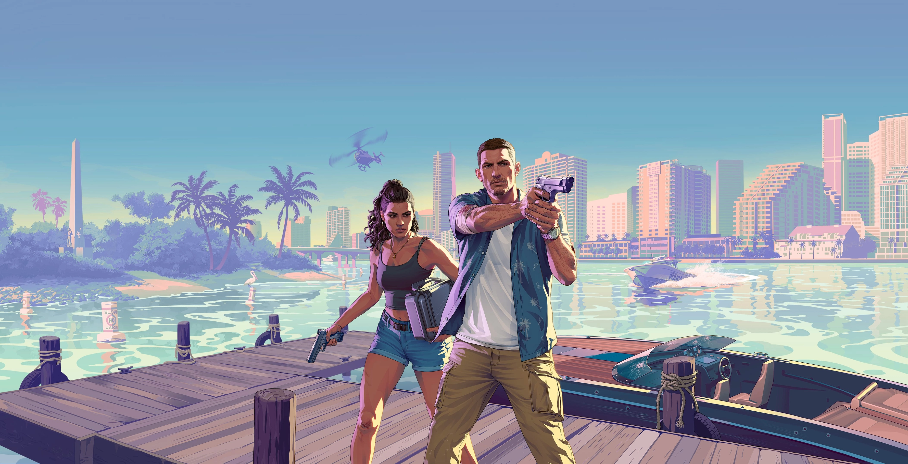

<div align="center">
  <br />
    <a href="https://www.rockstargames.com/VI" target="_blank">
      
    </a>
  <br />

   <div>
    
    
    
    
    
  </div>

  <h3 align="center">GTA VI - Interactive Website</h3>

   <div align="center">
     An immersive, animation-rich website showcasing the world of GTA VI with advanced GSAP animations and scroll-driven experiences.
    </div>
</div>

## 📋 <a name="table">Table of Contents</a>

1. 🤖 [Introduction](#introduction)
2. ⚙️ [Tech Stack](#tech-stack)
3. 🔋 [Features](#features)
4. 🤸 [Quick Start](#quick-start)
5. 🔗 [Assets](#assets)
6. 🚀 [More](#more)

## <a name="introduction">🤖 Introduction</a>

Welcome to the GTA VI interactive website project. This modern, scroll-driven experience is packed with advanced animations that bring the world of GTA VI to life. Follow the journey of Lucia Caminos and Jason Duval through the vibrant and dangerous world of Leonida.

The website features dynamic SplitText reveals, smooth parallax scrolling, and scroll-triggered effects using GSAP's ScrollTrigger. Sections are locked in place with pinned animations, video playback is synced to scroll position for cinematic storytelling, and visual impact is enhanced with scroll-based image masking. The fully responsive UI adapts beautifully across all screen sizes, ensuring an immersive experience for all users.

## <a name="tech-stack">⚙️ Tech Stack</a>

- **[Next.js](https://nextjs.org/)** - A React framework for production that gives you the best developer experience with all the features you need for production.

- **[React](https://react.dev/)** - A JavaScript library for building user interfaces, providing the component structure for modular development.

- **[GSAP](https://gsap.com/)** - A powerful JavaScript animation library used to create dynamic, scroll-driven visuals including SplitText animations, ScrollTrigger effects, parallax scrolling, pinned sections, and scroll-synced video playback.

- **[Tailwind CSS](https://tailwindcss.com/)** - A utility-first CSS framework that allows for rapid UI development with predefined classes.

- **[TypeScript](https://www.typescriptlang.org/)** - A strongly typed programming language that builds on JavaScript, giving you better tooling at any scale.

## <a name="features">🔋 Features</a>

👉 **Scroll-Driven Animations** - Experience a website that comes to life as you scroll, with elements animating in response to your scrolling position.

👉 **Character Showcases** - Detailed sections for main characters Lucia Caminos and Jason Duval with parallax image effects.

👉 **Video Sequence Control** - Videos that play and progress based on scroll position, creating a cinematic storytelling experience.

👉 **Pinned Sections** - Content sections that stay fixed on screen while animations play out as you scroll.

👉 **Parallax Effects** - Multi-layered parallax scrolling that adds depth and dimension to the viewing experience.

👉 **Mask Animations** - Creative use of mask animations to reveal and hide content in visually interesting ways.

👉 **Responsive Design** - Fully responsive layout that adapts to all screen sizes while maintaining animation integrity.

👉 **Timeline Animations** - Complex animation sequences orchestrated with GSAP timelines for smooth, coordinated motion.

👉 **Interactive Elements** - Interactive UI components that respond to user actions with animated feedback.

## <a name="quick-start">🤸 Quick Start</a>

Follow these steps to set up the project locally on your machine.

**Prerequisites**

Make sure you have the following installed on your machine:

- [Git](https://git-scm.com/)
- [Node.js](https://nodejs.org/en)
- [npm](https://www.npmjs.com/) (Node Package Manager)

**Cloning the Repository**

```bash
git clone https://github.com/yourusername/gta-vi.git
cd gta-vi
```

**Installation**

Install the project dependencies using npm:

```bash
npm install
```

**Running the Project**

```bash
npm run dev
```

Open [http://localhost:3000](http://localhost:3000) in your browser to view the project.

## <a name="assets">🔗 Assets</a>

The project uses various assets including:

- Character images for Lucia Caminos and Jason Duval
- Background images and overlays
- Video sequences that sync with scroll position
- SVG elements for UI components

All assets are organized in the public directory:
- Images: `public/images/`
- Videos: `public/videos/`

## <a name="more">🚀 More</a>

**Explore the Code**

Dive into the components directory to see how the animations are implemented:

- `components/features/` - Contains all the main feature components
- `components/ui/` - Contains reusable UI components

**Learn More About the Technologies**

- [GSAP Documentation](https://greensock.com/docs/)
- [Next.js Documentation](https://nextjs.org/docs)
- [Tailwind CSS Documentation](https://tailwindcss.com/docs)

**Contribute**

Contributions are welcome! Feel free to submit a pull request or open an issue if you have suggestions for improvements.
